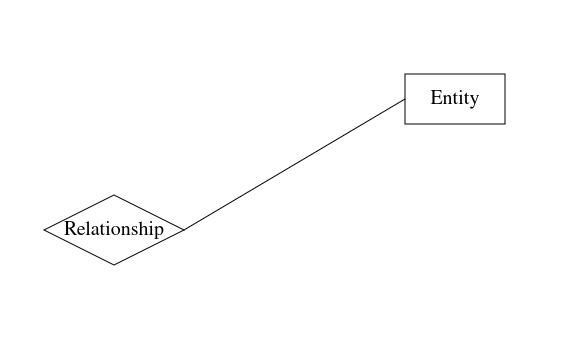
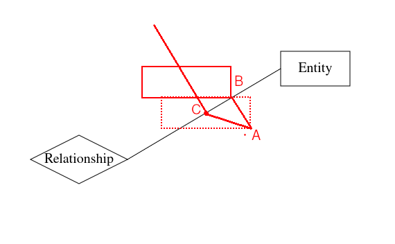

# How To Position Role Name Label

## Requirements
1. Role name label should be positioned about the center of role connection line.
2. Role name label should not intersect with the role connection line.

## Solution

First, I postion label so that the bottom-center of it is at the center of the role connection line.

Then I move the label along the line which is perpendicular to the role connection line
until the label does not intersect the role connection.

Finally, I draw the label whose bottom-center is at C.

### How To Get The Point C?

Vector AC = Vector AB + Vector BC

Assume  
Vector AB = (x1, y1),  
Vector BC = (-w/2, 0), w is the width of label bounding box,  
Vector AC = (x2, y2),  
and the k is the slope of role connection line.

Then  
x1 + (-w/2) = x2  
y1 + 0 = y2  
y1 = k * x1    
x1 * x2 + y1 * y2 = 0

The k and w is known, there 4 unkowns and 4 equations, so I can solve the equation group to get Vector AC(x2, y2).

Finally, Point C = Point A + Vector AC
